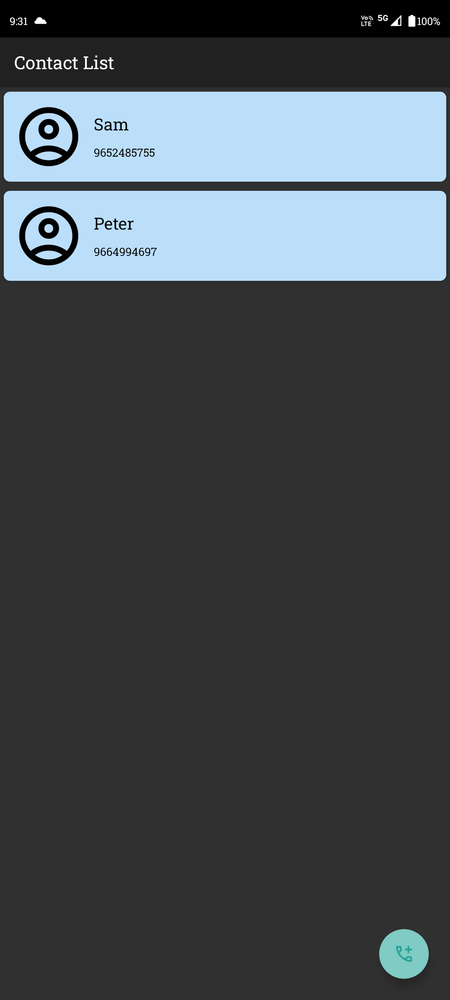

### 📱 Simple Contact Storage App

A minimal Android contact app built with Android Studio.
This app allows users to quickly add, update, and delete contacts with simple touch gestures. Ideal for testing, learning Android UI interactions, or demonstrating app basics.

---

### ✨ Features

* ✅ Tap **➕** icon to add a new contact
* ✅ Tap a **contact** to update its name or number
* ✅ **Long-press** a contact to delete it
* 🚫 No permanent storage – contacts are lost once the app is restarted

---

### 🧪 Demo Screenshots

| Home Screen                   | Add Contact                         | Update Contact                            | Long-Press to Delete                      |
| ----------------------------- | ----------------------------------- | ----------------------------------------- | ----------------------------------------- |
|  |  |  |  |


---

### 🛠 Tech Stack

* Android Studio
* Java
* XML
* No external database – data stored in memory only

---

### 🚀 How to Run

1. The apk file is provided in **Releases**
2. Download and install on your **Android device**
3. Add, update, or delete contacts with touch interactions
4. **Restart the app** to see that the data resets

---

### 🔍 Sample Pre-Added Contacts (for Demo)

> As there's no persistent storage, you can pre-load contacts like below in your MainActivity:

```java
arrcon.add(new conatctmodel(R.drawable.b, num, name));
```

---

### 📂 APK for Testing

You can download and install the app using the provided APK file:

**[📦 app-debug.apk](app/build/outputs/apk/debug/app-debug.apk)**

---

### 📝 License

This project is free and open source under the [MIT License](LICENSE).

---

If you want, I can also clone this repo and add or make changes to this.